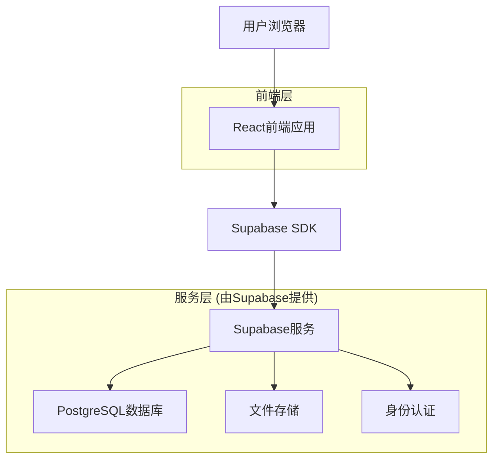
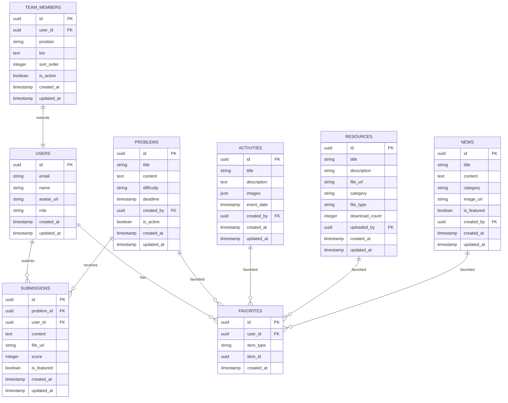

# 北京大学数学科学学院学生会学术组官方网站技术架构文档

## 1. 架构设计



## 2. 技术描述

* **前端**: React\@18 + TypeScript + Tailwind CSS\@3 + Vite

* **后端**: Supabase (提供数据库、认证、存储服务)

* **数据库**: Supabase PostgreSQL

* **文件存储**: Supabase Storage

* **认证系统**: Supabase Auth

## 3. 路由定义

| 路由              | 用途                 |
| --------------- | ------------------ |
| /               | 首页，展示最新动态和快速入口     |
| /about          | 关于我们页面，展示部门介绍和团队成员 |
| /activities     | 活动展示页面，展示活动图片和详情   |
| /activities/:id | 活动详情页面，展示单个活动的详细信息 |
| /resources      | 学习资源页面，提供资料下载和搜索   |
| /problems       | 征解题目页面，展示题目列表      |
| /problems/:id   | 题目详情页面，展示题目内容和提交答案 |
| /news           | 学术动态页面，展示新闻和讲座信息   |
| /news/:id       | 新闻详情页面，展示单条新闻的详细内容 |
| /contact        | 联系我们页面，展示联系方式和反馈表单 |
| /login          | 登录页面，用户身份认证        |
| /register       | 注册页面，新用户注册         |
| /profile        | 用户中心，个人信息和收藏管理     |
| /admin          | 管理后台，内容管理和用户管理     |

## 4. 数据模型

### 4.1 数据模型定义



### 4.2 数据定义语言

**用户表 (users)**

```sql
-- 创建用户表
CREATE TABLE users (
    id UUID PRIMARY KEY DEFAULT gen_random_uuid(),
    email VARCHAR(255) UNIQUE NOT NULL,
    name VARCHAR(100) NOT NULL,
    avatar_url TEXT,
    role VARCHAR(20) DEFAULT 'user' CHECK (role IN ('user', 'admin')),
    created_at TIMESTAMP WITH TIME ZONE DEFAULT NOW(),
    updated_at TIMESTAMP WITH TIME ZONE DEFAULT NOW()
);

-- 创建索引
CREATE INDEX idx_users_email ON users(email);
CREATE INDEX idx_users_role ON users(role);

-- 设置权限
GRANT SELECT ON users TO anon;
GRANT ALL PRIVILEGES ON users TO authenticated;
```

**征解题目表 (problems)**

```sql
-- 创建征解题目表
CREATE TABLE problems (
    id UUID PRIMARY KEY DEFAULT gen_random_uuid(),
    title VARCHAR(200) NOT NULL,
    content TEXT NOT NULL,
    difficulty VARCHAR(20) DEFAULT 'medium' CHECK (difficulty IN ('easy', 'medium', 'hard')),
    deadline TIMESTAMP WITH TIME ZONE,
    created_by UUID REFERENCES users(id),
    is_active BOOLEAN DEFAULT true,
    created_at TIMESTAMP WITH TIME ZONE DEFAULT NOW(),
    updated_at TIMESTAMP WITH TIME ZONE DEFAULT NOW()
);

-- 创建索引
CREATE INDEX idx_problems_created_by ON problems(created_by);
CREATE INDEX idx_problems_deadline ON problems(deadline);
CREATE INDEX idx_problems_is_active ON problems(is_active);

-- 设置权限
GRANT SELECT ON problems TO anon;
GRANT ALL PRIVILEGES ON problems TO authenticated;
```

**答案提交表 (submissions)**

```sql
-- 创建答案提交表
CREATE TABLE submissions (
    id UUID PRIMARY KEY DEFAULT gen_random_uuid(),
    problem_id UUID REFERENCES problems(id) ON DELETE CASCADE,
    user_id UUID REFERENCES users(id) ON DELETE CASCADE,
    content TEXT NOT NULL,
    file_url TEXT,
    score INTEGER CHECK (score >= 0 AND score <= 100),
    is_featured BOOLEAN DEFAULT false,
    created_at TIMESTAMP WITH TIME ZONE DEFAULT NOW(),
    updated_at TIMESTAMP WITH TIME ZONE DEFAULT NOW()
);

-- 创建索引
CREATE INDEX idx_submissions_problem_id ON submissions(problem_id);
CREATE INDEX idx_submissions_user_id ON submissions(user_id);
CREATE INDEX idx_submissions_score ON submissions(score DESC);
CREATE INDEX idx_submissions_is_featured ON submissions(is_featured);

-- 设置权限
GRANT SELECT ON submissions TO anon;
GRANT ALL PRIVILEGES ON submissions TO authenticated;
```

**活动表 (activities)**

```sql
-- 创建活动表
CREATE TABLE activities (
    id UUID PRIMARY KEY DEFAULT gen_random_uuid(),
    title VARCHAR(200) NOT NULL,
    description TEXT,
    images JSONB,
    event_date TIMESTAMP WITH TIME ZONE,
    created_by UUID REFERENCES users(id),
    created_at TIMESTAMP WITH TIME ZONE DEFAULT NOW(),
    updated_at TIMESTAMP WITH TIME ZONE DEFAULT NOW()
);

-- 创建索引
CREATE INDEX idx_activities_event_date ON activities(event_date DESC);
CREATE INDEX idx_activities_created_by ON activities(created_by);

-- 设置权限
GRANT SELECT ON activities TO anon;
GRANT ALL PRIVILEGES ON activities TO authenticated;
```

**学习资源表 (resources)**

```sql
-- 创建学习资源表
CREATE TABLE resources (
    id UUID PRIMARY KEY DEFAULT gen_random_uuid(),
    title VARCHAR(200) NOT NULL,
    description TEXT,
    file_url TEXT NOT NULL,
    category VARCHAR(50) NOT NULL,
    file_type VARCHAR(20),
    download_count INTEGER DEFAULT 0,
    uploaded_by UUID REFERENCES users(id),
    created_at TIMESTAMP WITH TIME ZONE DEFAULT NOW(),
    updated_at TIMESTAMP WITH TIME ZONE DEFAULT NOW()
);

-- 创建索引
CREATE INDEX idx_resources_category ON resources(category);
CREATE INDEX idx_resources_uploaded_by ON resources(uploaded_by);
CREATE INDEX idx_resources_download_count ON resources(download_count DESC);

-- 设置权限
GRANT SELECT ON resources TO anon;
GRANT ALL PRIVILEGES ON resources TO authenticated;
```

**新闻动态表 (news)**

```sql
-- 创建新闻动态表
CREATE TABLE news (
    id UUID PRIMARY KEY DEFAULT gen_random_uuid(),
    title VARCHAR(200) NOT NULL,
    content TEXT NOT NULL,
    category VARCHAR(50) DEFAULT 'general',
    image_url TEXT,
    is_featured BOOLEAN DEFAULT false,
    created_by UUID REFERENCES users(id),
    created_at TIMESTAMP WITH TIME ZONE DEFAULT NOW(),
    updated_at TIMESTAMP WITH TIME ZONE DEFAULT NOW()
);

-- 创建索引
CREATE INDEX idx_news_category ON news(category);
CREATE INDEX idx_news_is_featured ON news(is_featured);
CREATE INDEX idx_news_created_at ON news(created_at DESC);

-- 设置权限
GRANT SELECT ON news TO anon;
GRANT ALL PRIVILEGES ON news TO authenticated;
```

**团队成员表 (team\_members)**

```sql
-- 创建团队成员表
CREATE TABLE team_members (
    id UUID PRIMARY KEY DEFAULT gen_random_uuid(),
    user_id UUID REFERENCES users(id) ON DELETE CASCADE,
    position VARCHAR(100) NOT NULL,
    bio TEXT,
    sort_order INTEGER DEFAULT 0,
    is_active BOOLEAN DEFAULT true,
    created_at TIMESTAMP WITH TIME ZONE DEFAULT NOW(),
    updated_at TIMESTAMP WITH TIME ZONE DEFAULT NOW()
);

-- 创建索引
CREATE INDEX idx_team_members_user_id ON team_members(user_id);
CREATE INDEX idx_team_members_sort_order ON team_members(sort_order);
CREATE INDEX idx_team_members_is_active ON team_members(is_active);

-- 设置权限
GRANT SELECT ON team_members TO anon;
GRANT ALL PRIVILEGES ON team_members TO authenticated;
```

**收藏表 (favorites)**

```sql
-- 创建收藏表
CREATE TABLE favorites (
    id UUID PRIMARY KEY DEFAULT gen_random_uuid(),
    user_id UUID REFERENCES users(id) ON DELETE CASCADE,
    item_type VARCHAR(20) NOT NULL CHECK (item_type IN ('problem', 'activity', 'resource', 'news')),
    item_id UUID NOT NULL,
    created_at TIMESTAMP WITH TIME ZONE DEFAULT NOW()
);

-- 创建索引
CREATE INDEX idx_favorites_user_id ON favorites(user_id);
CREATE INDEX idx_favorites_item_type_id ON favorites(item_type, item_id);
CREATE UNIQUE INDEX idx_favorites_unique ON favorites(user_id, item_type, item_id);

-- 设置权限
GRANT SELECT ON favorites TO anon;
GRANT ALL PRIVILEGES ON favorites TO authenticated;
```

**初始化数据**

```sql
-- 插入管理员用户
INSERT INTO users (email, name, role) VALUES 
('admin@math.pku.edu.cn', '系统管理员', 'admin');

-- 插入示例新闻
INSERT INTO news (title, content, category, is_featured, created_by) VALUES 
('欢迎访问北大数学学院学生会学术组官网', '我们致力于为数学专业学生提供优质的学术资源和交流平台...', 'announcement', true, (SELECT id FROM users WHERE email = 'admin@math.pku.edu.cn'));

-- 插入示例资源分类
INSERT INTO resources (title, description, file_url, category, file_type, uploaded_by) VALUES 
('高等数学期中模拟试题2023', '2023年高等数学期中考试模拟试题及答案', '/files/calculus_2023.pdf', '期中试题', 'pdf', (SELECT id FROM users WHERE email = 'admin@math.pku.edu.cn'));
```

